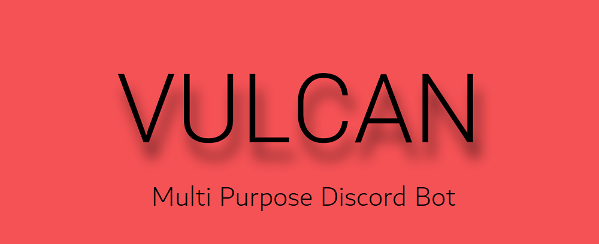

    <d>
        
    

    
 
    
    
    
    
    

    

    
    

# Overview

**Vulcan** is a multi-purpose discord bot built with [discord.js](https://github.com/discordjs/discord.js). Its creation purpose is set out to acomplish the tasks of administration, utility and entertainment for the discord server of our group of friends. As such, the design and features are tailored to our needs.
  
The project is currently **under early development**. All of the code present is subject to significant changes.

# Documentation

Currently there is no documentation. This page will be updated as soon as there is a change.

# Invite Vulcan

Vulcan features are **disabled by default** on __new guilds__. They must be activated by one of the bot owners.

Note that this is **intended**. Once Vulcan is invited to a new server an automatic request to enable its features on the new guild is sent to the bot owners. You may also use the `authorise` command to manually send a request. 

To invite Vulcan to your discord server simply click the image link below:

# Self Hosting

There are **two** ways you may achieve this:

1. The first is to host Vulcan on your local computer.
    - (required the **master** branch version of Vulcan)
2. The second and preferred way, is to deploy Vulcan using heroku.
    - (required the **deployment** branch version of Vulcan)

## Local Host

Currently there are no installation wizards. Manual installation is necessary by following these steps:

0. Remember, if asked to "ADD XYZ TO 'PATH'" on any of the installations say **yes**.
1. Download and install [python](https://www.python.org/downloads/).
2. Download and install [node.js](https://nodejs.org/en/download/).
3. Download and extract the [zipped repository code](https://github.com/GitPaulo/Vulcan.git).
4. Open a [shell](https://git-scm.com/downloads) in the location of directory of the extraced zip.
5. Run the following command: `npm install && npm test`
6. Navigate to the new `'settings/'` folder and fill in the required configuration & credentials.
7. Run the following command: `npm start`

(Closing the shell window will result in the bot shutting down)

## Heroku

We use [heroko](https://dashboard.heroku.com/) for the deployment of the bot for our own server.
You may do the same as well.

If you are interested, please refer to the ['deployment'](https://github.com/GitPaulo/Vulcan/tree/deployment) branch.

# FAQ

May I use code in this repository?

- **Yes.** Follow the license.
  
May I host this program publicly?

- **Yes.** Credit this repository and follow the license.

What platforms does self-hosting support?

- Both modern Windows and Linux machines have been tested to be compatible with Vulcan.
